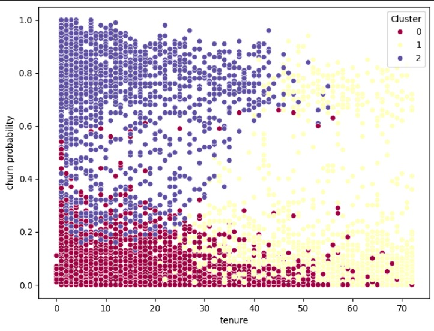
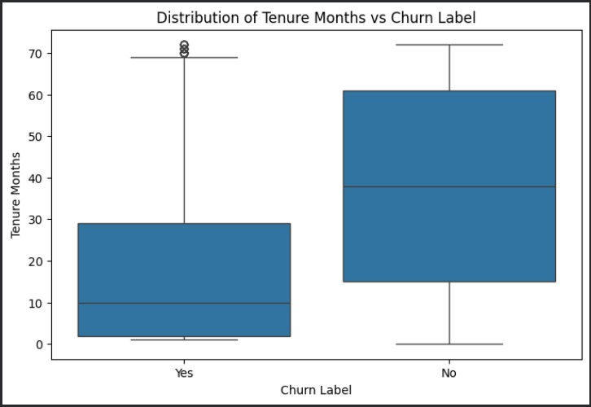
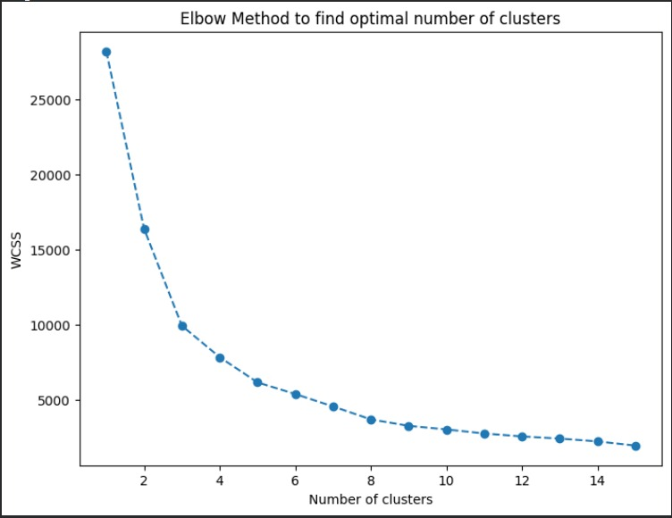

# Customer Segmentation and Churn Prediction

## Overview
Developed an end-to-end machine learning pipeline for telecom customer churn prediction and behavioral segmentation.

## Features
- Data Cleaning and Preprocessing
- Exploratory Data Analysis (EDA)
- Random Forest Churn Prediction
- Class Imbalance Handling
- Hyperparameter Tuning
- Cross Validation
- ROC-AUC Evaluation
- K-Means Customer Segmentation

## Tech Stack
- Python
- Pandas
- NumPy
- Scikit-Learn
- Matplotlib
- Seaborn

## Models Used
### Churn Prediction
- Random Forest Classifier

### Customer Segmentation
- K-Means Clustering

## Business Impact
- Identified customers likely to churn
- Segmented customers into actionable groups
- Generated insights for customer retention strategies

## Visualizations

### Customer Segmentation

### Churn Distribution

### Elbow Method

